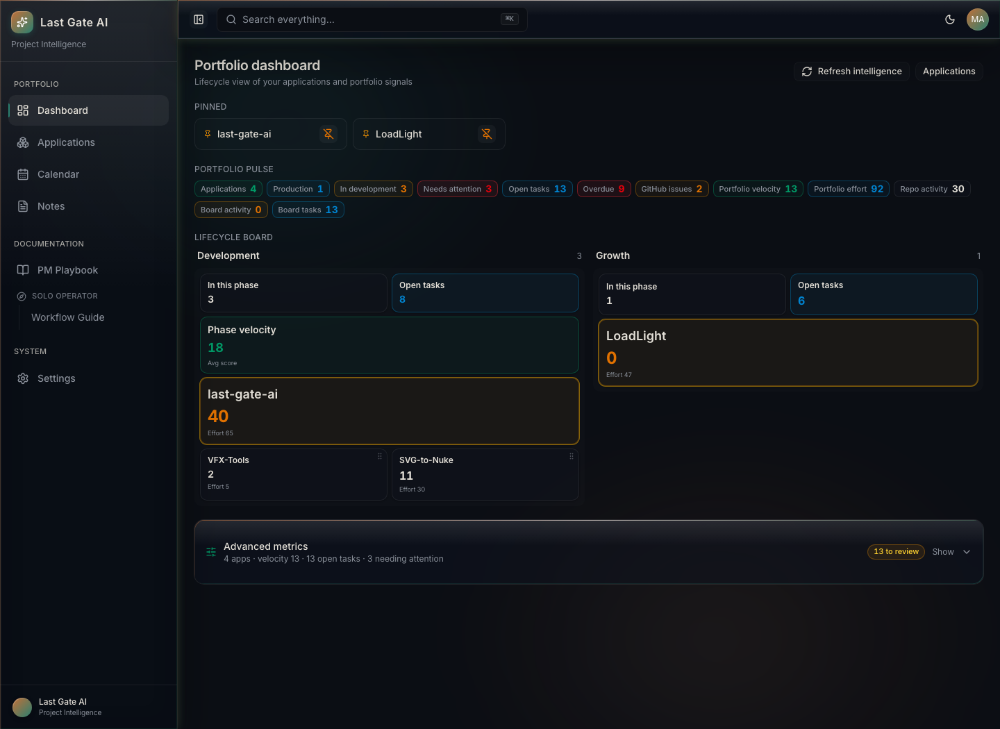
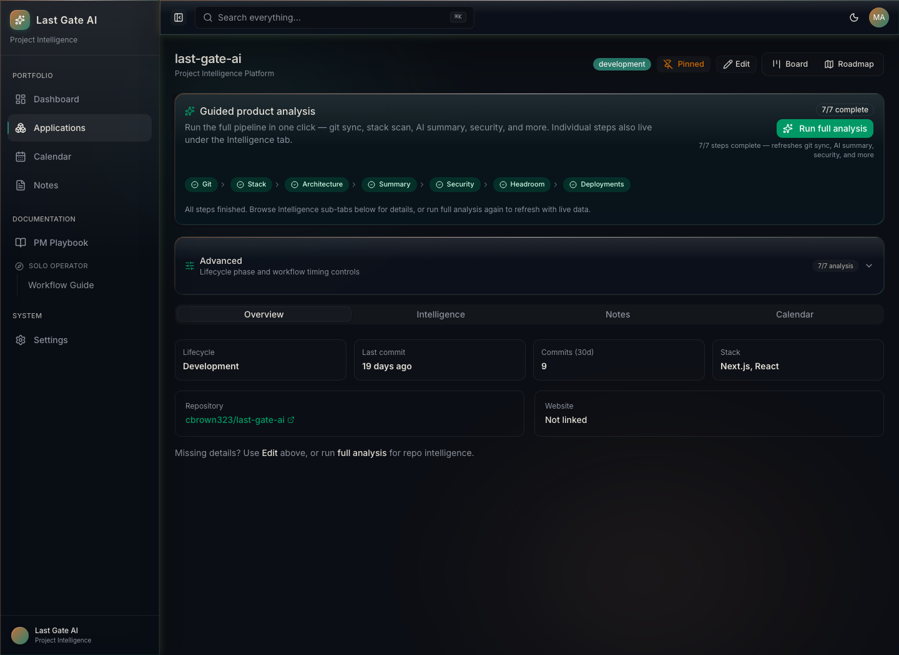

# Last Gate AI

**The project intelligence dashboard for solo developers and small software portfolios.**

Bring repositories, tasks, delivery signals, and project health into one place. Last Gate AI syncs your GitHub projects, turns repository activity into an actionable portfolio view, and runs a guided intelligence pipeline across every application you maintain.



## See the whole portfolio. Know what needs attention.

Last Gate AI is built for the moment when one project becomes five and keeping the state of each one in your head stops working.

- **Portfolio command center** — lifecycle stage, open work, velocity, effort, and attention signals at a glance
- **GitHub-aware application registry** — import repositories and keep commit, issue, stack, and deployment data in sync
- **Guided project intelligence** — run git sync, stack detection, architecture mapping, AI summary, security, headroom, and deployment checks as one pipeline
- **Built-in delivery workflow** — Kanban boards, roadmaps, priorities, due dates, notes, and calendar views for every application
- **Useful without an AI key** — core tracking and GitHub intelligence work without a model provider; summaries fall back to an offline template

## Project intelligence in one run

Run the complete analysis pipeline from an application's overview, then inspect each result in detail from the Intelligence tab.



<!-- Add the 30-second intelligence-run GIF here when it is available. -->

## Quick start

### Requirements

- Node.js 20+
- npm
- A GitHub personal access token for repository sync

### Run locally

```bash
git clone https://github.com/cbrown323/last-gate-ai.git
cd last-gate-ai
npm install
npx prisma migrate dev
npm run dev
```

Open [http://localhost:3000](http://localhost:3000).

Create `.env.local`, or add keys through **Settings → API keys** in the app:

```bash
GITHUB_TOKEN=ghp_...       # required for GitHub sync
AI_GATEWAY_API_KEY=...     # optional: enables live AI summaries
```

Restart the development server after changing environment variables.

## From empty dashboard to useful signal

1. Open **Settings** and connect GitHub. AI, Vercel, and Railway are optional.
2. Go to **Applications → Import from GitHub** and choose a repository.
3. Open the application and run **Full analysis** to populate its intelligence.
4. Use the portfolio dashboard to find stale projects, overdue work, and lifecycle bottlenecks.
5. Move between **Board** and **Roadmap** to plan and execute the next work.

## Intelligence pipeline

| Step | What it adds |
| --- | --- |
| Git | Repository activity, commit statistics, and issue signals |
| Stack | Framework, language, and dependency detection |
| Architecture | A map of the application's structure |
| Summary | AI-generated or offline project summary |
| Security | Repository-level security findings and recommendations |
| Headroom | Maintainability and growth constraints |
| Deployments | Vercel and Railway deployment visibility |

## Stack

- Next.js App Router, React, and TypeScript
- shadcn/ui and Tailwind CSS
- Prisma with SQLite for local development
- Vercel AI SDK for optional AI summaries
- GitHub API integration through Octokit

## Configuration

See [`.env.example`](.env.example) for all supported environment variables. Tokens belong in `.env.local`; never expose them to the client or commit them.

## License

Licensed under the [Apache License 2.0](LICENSE). You can use, modify, and distribute Last Gate AI, with the license's attribution and notice requirements.
